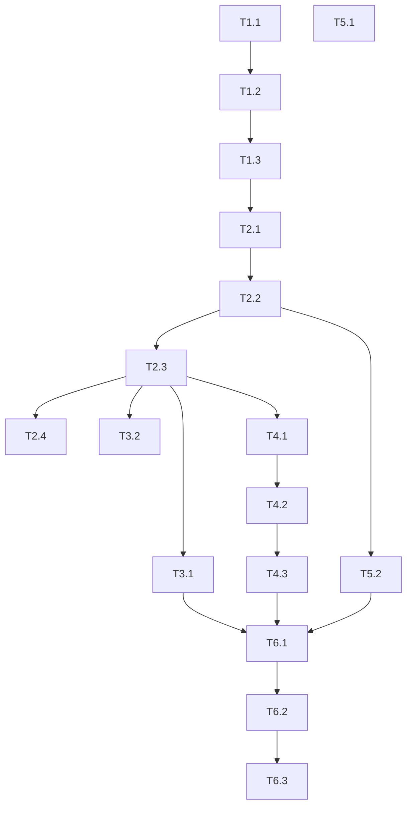

# TASK_init

## 任务清单

### 1. Project Initialization
- [ ] **Task-1.1**: Initialize React Project with Vite, TypeScript, Tailwind CSS.
- [ ] **Task-1.2**: Install dependencies (Ant Design, Day.js, Zustand, etc.).
- [ ] **Task-1.3**: Configure project structure (src/components, src/store, src/types, src/utils).

### 2. Core Logic & Store
- [ ] **Task-2.1**: Define TypeScript interfaces (System, Plan, Schedule) in `src/types`.
- [ ] **Task-2.2**: Implement `ConflictEngine` utility class/function.
- [ ] **Task-2.3**: Implement Zustand store (`useAppStore`) with actions for Plans and Systems, including local storage persistence.
- [ ] **Task-2.4**: Create initial Mock Data for demonstration.

### 3. UI Implementation - Basics
- [ ] **Task-3.1**: Create Main Layout (Sidebar/Header).
- [ ] **Task-3.2**: Implement **System Management** page (List view, Add System modal).

### 4. UI Implementation - Visualization (Core)
- [ ] **Task-4.1**: Implement `TimelineHeader` (Dates axis).
- [ ] **Task-4.2**: Implement `ResourceRow` component (System row showing plan blocks).
- [ ] **Task-4.3**: Implement `TimelineView` container integrating Header and Rows.
    - *Requirement*: Highlight "Outer Gray" & "Full Release" periods distinctively.
    - *Requirement*: Show conflict indicators red.

### 5. UI Implementation - Plan Management
- [ ] **Task-5.1**: Implement `PlanList` page (Card or Table view).
- [ ] **Task-5.2**: Implement `PlanEditor` (Modal/Drawer).
    - *Logic*: When dates or systems change, trigger `ConflictEngine` and show warnings.

### 6. Integration & Polish
- [ ] **Task-6.1**: Integrate all components into Dashboard.
- [ ] **Task-6.2**: Final testing of conflict scenarios.
- [ ] **Task-6.3**: UI Polish (colors, spacing, "Plan Card" styling).

## 依赖关系图

