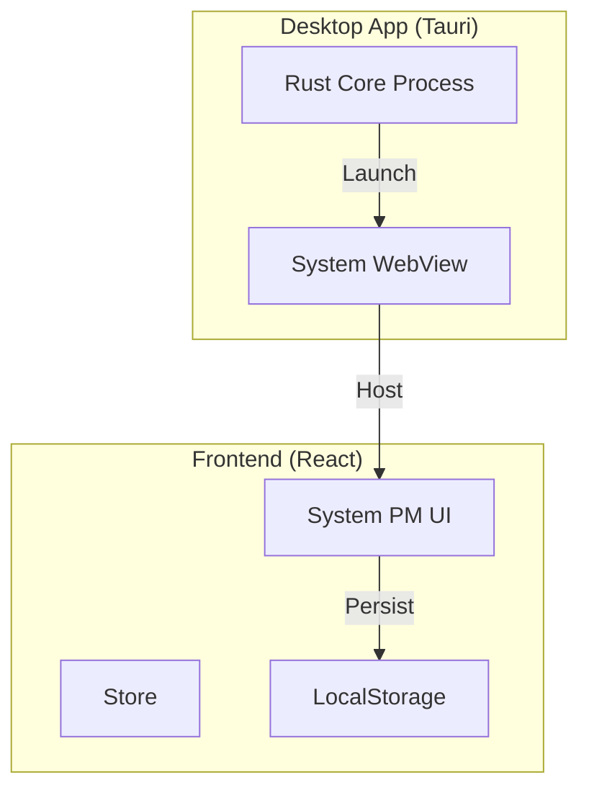

# DESIGN_tauri_migration

## 1. 架构调整
在原有 Web 架构外层包裹 Tauri 层。



## 2. 关键配置变更

### 2.1 `package.json`
需要增加 Tauri CLI 依赖和运行脚本。
```json
"scripts": {
  "tauri": "tauri"
}
```

### 2.2 `vite.config.ts`
Tauri 对前端构建工具有特定要求，以确保兼容性和性能：
1.  **明确的目标环境**: 设置 `target` 为 `['es2021', 'chrome100', 'safari13']` (适配 WebView 版本)。
2.  **禁用 minify**: 在 debug 模式下禁用压缩以便调试。
3.  **Env 前缀**: 确保环境变量正确透传。

### 2.3 `src-tauri/tauri.conf.json`
这是 Tauri 的核心配置文件。
- **Identifier**: `com.system-pm.app`
- **DistDir**: `../dist` (指向 Vite 的构建输出)
- **DevPath**: `http://localhost:5173` (指向 Vite 的开发服务)
- **Window**:
  - Width: 1200
  - Height: 800
  - Title: "System PM"

## 3. 实施策略
由于当前环境未安装 Rust (`cargo not found`)，我无法直接运行 `tauri init` 来生成脚手架。
**策略**: 手动创建 `src-tauri` 目录及其核心文件 (`Cargo.toml`, `tauri.conf.json`, `src/main.rs`)。这等同于手动执行了 init 过程。

### 3.1 文件清单
1.  `src-tauri/Cargo.toml`: Rust 项目依赖描述。
2.  `src-tauri/tauri.conf.json`: Tauri 配置。
3.  `src-tauri/src/main.rs`: Rust 入口文件。
4.  `src-tauri/build.rs`: 构建脚本。
5.  `.github/workflows/release.yml`: (可选) 自动构建流程。

## 4. 依赖安装
用户需要在本地执行：
1.  安装 Rust: `curl --proto '=https' --tlsv1.2 -sSf https://sh.rustup.rs | sh`
2.  安装前端依赖: `pnpm add -D @tauri-apps/cli @tauri-apps/api`

